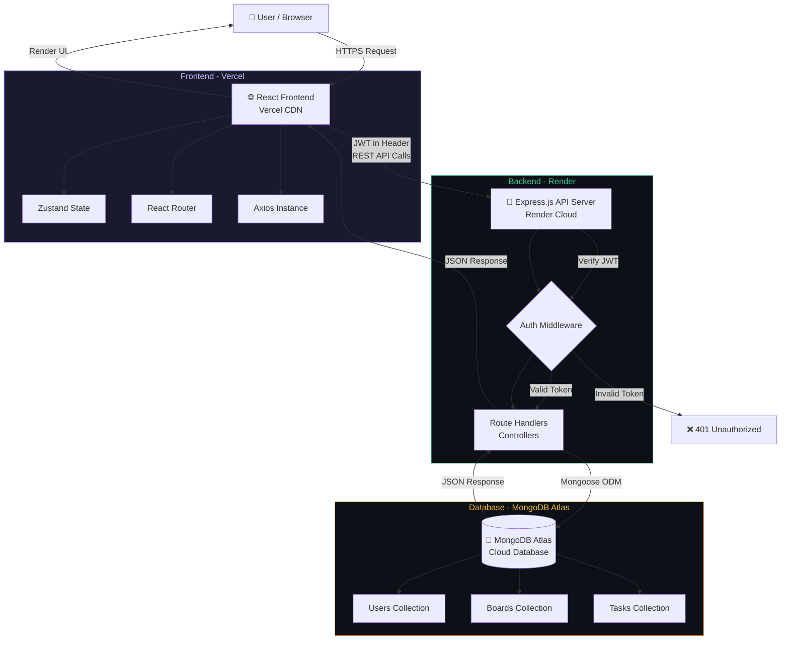
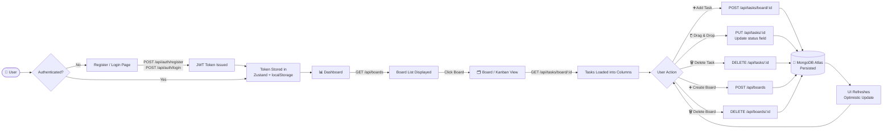

<div align="center">

# ⚡ TaskFlow

### **Full-Stack Kanban Project Management — Built with the MERN Stack**

*Plan it. Build it. Ship it.*

[](https://react.dev)
[](https://vitejs.dev)
[](https://nodejs.org)
[](https://expressjs.com)
[](https://mongodb.com)
[](https://jwt.io)
[](https://vercel.com)
[](https://render.com)

---

🌐 **[Live Demo](https://taskflow-dun-xi.vercel.app)** &nbsp;|&nbsp; 🔧 **[API Base URL](https://taskflow-98es.onrender.com)** &nbsp;|&nbsp; 📁 **[Repository](https://github.com/shafiq-ahamed04/taskflow)**

</div>

---

## 📌 Project Overview

**TaskFlow** is a production-ready, full-stack Kanban project management application built on the **MERN stack** (MongoDB, Express.js, React, Node.js). It enables individuals and teams to plan, track, and manage work visually — similar to industry-grade tools like Trello and Linear.

### Why TaskFlow?

Modern software teams need a tool that is fast, intuitive, and visual. TaskFlow was built to demonstrate real-world full-stack engineering by solving a genuine problem: organizing complex work into clear, manageable workflows using the proven Kanban methodology.

### Real-World Use Cases

- 🧑‍💻 Software teams tracking sprint tasks
- 📋 Individuals managing personal project goals
- 🎯 Freelancers organizing client deliverables
- 📊 Students tracking academic assignments

---

## ✨ Key Features

| Feature | Description |
|---|---|
| 🔐 **JWT Authentication** | Secure register/login with token-based auth; protected API routes |
| 📋 **Board Management** | Create, view, and delete multiple project boards |
| 🔄 **Bidirectional Kanban Sync** | Daily Habits are linked with Kanban tasks. Adding a habit auto-creates a task. Ticking/moving tasks dynamically syncs across Habit & Board views! |
| ✅ **Daily Habits Tracker** | Complete micro-routines with checklist toggle, current progress % bar, and consecutive streak calculations. |
| 📓 **Monospace Journaling** | Log daily notes, reflections, and tasks. Filtered by calendar date with beautiful monospace glass layout cards. |
| 📊 **Analytics Dashboard** | Live stats counters, Recharts task progress visualizer per board, and 7-day habit completion dot-matrix heatmap grid. |
| ⚙️ **Premium Settings** | Persistent theme-switching framework (Dark/Light mode), active color theme choice, API latency summary, and 5-star rating widget. |
| 🖱️ **Drag & Drop** | Move tasks between columns (To Do → In Progress → Done) using `@dnd-kit` |
| 🏷️ **Priority Labels** | Tag tasks as Low, Medium, or High priority with colour-coded badges |
| 🛡️ **Protected Routes** | Client-side route guards using Zustand auth state |
| 🌙 **Dark Mode UI** | Obsidian Flux design system — premium glassmorphism SaaS aesthetic |
| 📱 **Responsive Design** | Optimized for desktop, tablet, and mobile viewports |
| ☁️ **Cloud Deployed** | Frontend on Vercel, Backend on Render, Database on MongoDB Atlas |
| ⚡ **Optimistic Updates** | UI updates instantly on drag-drop; reverts on API failure |

---

## 🏗️ Architecture Diagram



---

## 🔄 Application Workflow



---

## 📁 Folder Structure

```
taskflow/
│
├── client/                         # React + Vite Frontend
│   ├── public/
│   ├── src/
│   │   ├── api/
│   │   │   └── axios.js            # Axios instance with base URL + JWT interceptor
│   │   ├── pages/
│   │   │   ├── Login.jsx           # Login page — split layout, glass auth card
│   │   │   ├── Register.jsx        # Registration — password strength, testimonial
│   │   │   ├── Dashboard.jsx       # Board grid, stats, empty state, sidebar
│   │   │   └── BoardPage.jsx       # Kanban columns, DnD, task CRUD
│   │   ├── store/
│   │   │   └── authStore.js        # Zustand auth state (user, token, logout)
│   │   ├── App.jsx                 # Routes & protected route logic
│   │   ├── main.jsx                # React entry point
│   │   └── index.css               # Obsidian Flux design tokens + global styles
│   ├── .env                        # VITE_API_URL
│   ├── vercel.json                 # SPA rewrite + Vite config for Vercel
│   ├── vite.config.js
│   └── package.json
│
├── server/                         # Node.js + Express Backend
│   ├── controllers/
│   │   ├── authController.js       # Register, Login logic + JWT signing
│   │   ├── boardController.js      # CRUD for boards
│   │   └── taskController.js       # CRUD + status update for tasks
│   ├── middleware/
│   │   └── authMiddleware.js       # JWT token verification (protect)
│   ├── models/
│   │   ├── User.js                 # Mongoose User schema
│   │   ├── Board.js                # Mongoose Board schema
│   │   └── Task.js                 # Mongoose Task schema (status, priority)
│   ├── routes/
│   │   ├── authRoutes.js           # /api/auth
│   │   ├── boardRoutes.js          # /api/boards
│   │   └── taskRoutes.js           # /api/tasks
│   ├── index.js                    # Express app entry, CORS, routes
│   ├── render.yaml                 # Render deployment config
│   ├── .env                        # MONGO_URI, JWT_SECRET, PORT
│   └── package.json
│
├── README.md
├── .gitignore
└── Dockerfile                      # (Optional) Containerization
```

---

## 🖼️ Screenshots

### Login Page
> *Split-panel layout — hero tagline on left, glassmorphism auth card on right*


---

### Dashboard — My Boards
> *Sidebar navigation, stat cards, board grid with glassmorphism cards*


---

### Board View — Kanban
> *3 Kanban columns — To Do, In Progress, Done — with priority badge tasks*


---

### Drag & Drop Tasks
> *Smooth drag-and-drop between columns with real-time database sync*


---

### Mobile View
> *Fully responsive — sidebar collapses, columns stack vertically*


---

## 📡 REST API Reference

### Auth Endpoints

| Method | Endpoint | Auth | Description |
|--------|----------|------|-------------|
| `POST` | `/api/auth/register` | ❌ Public | Register new user account |
| `POST` | `/api/auth/login` | ❌ Public | Login & receive JWT token |

### Board Endpoints

| Method | Endpoint | Auth | Description |
|--------|----------|------|-------------|
| `GET` | `/api/boards` | ✅ Required | Get all boards for current user |
| `POST` | `/api/boards` | ✅ Required | Create a new board |
| `GET` | `/api/boards/:id` | ✅ Required | Get single board by ID |
| `DELETE` | `/api/boards/:id` | ✅ Required | Delete a board |

### Task Endpoints

| Method | Endpoint | Auth | Description |
|--------|----------|------|-------------|
| `GET` | `/api/tasks/board/:boardId` | ✅ Required | Get all tasks for a board |
| `POST` | `/api/tasks/board/:boardId` | ✅ Required | Create task in a board |
| `PUT` | `/api/tasks/:id` | ✅ Required | Update task (title, status, priority) |
| `DELETE` | `/api/tasks/:id` | ✅ Required | Delete a task |

> All protected routes require `Authorization: Bearer <token>` header.

---

## 🚀 Local Installation Guide

### Prerequisites

- [Node.js](https://nodejs.org) v18+
- [Git](https://git-scm.com)
- [MongoDB Atlas](https://mongodb.com/atlas) URI (free tier works)

---

### Step 1 — Clone the Repository

```bash
git clone https://github.com/shafiq-ahamed04/taskflow.git
cd taskflow
```

### Step 2 — Set Up the Backend

```bash
cd server
npm install
```

Create a `.env` file inside `server/`:

```env
MONGO_URI=your_mongodb_atlas_connection_string
JWT_SECRET=your_super_secret_jwt_key_here
CLIENT_URL=http://localhost:5173
PORT=5000
```

Start the backend server:

```bash
npm run dev
```

> Backend runs at: **http://localhost:5000**

---

### Step 3 — Set Up the Frontend

Open a new terminal:

```bash
cd client
npm install
```

Create a `.env` file inside `client/`:

```env
VITE_API_URL=http://localhost:5000/api
```

Start the frontend dev server:

```bash
npm run dev
```

> Frontend runs at: **http://localhost:5173**

---

### Step 4 — Open in Browser

Navigate to **[http://localhost:5173](http://localhost:5173)**, register a new account, and start creating boards!

---

## 🔑 Environment Variables

### Backend — `server/.env`

```env
# MongoDB Atlas connection string
MONGO_URI=mongodb+srv://<username>:<password>@cluster.mongodb.net/taskflow

# JWT signing secret (use a strong random string)
JWT_SECRET=your_jwt_secret_minimum_32_chars

# Allowed frontend origin for CORS
CLIENT_URL=http://localhost:5173

# Express server port
PORT=5000
```

### Frontend — `client/.env`

```env
# Points to your Express backend (local or production)
VITE_API_URL=http://localhost:5000/api
```

> ⚠️ **Never commit `.env` files.** Both are listed in `.gitignore`.

---

## ☁️ Deployment

### Frontend → Vercel

1. Go to [vercel.com](https://vercel.com) → **New Project** → Import `shafiq-ahamed04/taskflow`
2. Set **Root Directory** → `client`
3. Add Environment Variable: `VITE_API_URL` = your Render backend URL
4. Deploy — `vercel.json` handles SPA routing automatically

**Live:** [https://taskflow-dun-xi.vercel.app](https://taskflow-dun-xi.vercel.app)

---

### Backend → Render

1. Go to [render.com](https://render.com) → **New Web Service** → Connect repo
2. Set **Root Directory** → `server`
3. `render.yaml` auto-configures build and start commands
4. Add Environment Variables:
   - `MONGO_URI` — MongoDB Atlas connection string
   - `JWT_SECRET` — your secret key
   - `CLIENT_URL` — your Vercel frontend URL

**Live:** [https://taskflow-98es.onrender.com](https://taskflow-98es.onrender.com)

---

### Database → MongoDB Atlas

1. Create a free cluster at [mongodb.com/atlas](https://mongodb.com/atlas)
2. Whitelist all IPs (`0.0.0.0/0`) for Render compatibility
3. Copy the connection string into `MONGO_URI`

---

## 🔮 Future Enhancements

| Feature | Status |
|---|---|
| 🐳 Docker & Docker Compose | Planned |
| 📜 Activity Logs per Board | Planned |
| 👥 Team Collaboration & Invites | Planned |
| 🔔 Real-time Notifications (Socket.io) | Planned |
| 📎 File Attachments per Task | Planned |
| 👤 Role-Based Access Control (RBAC) | Planned |
| 🔁 CI/CD Pipeline (GitHub Actions) | Planned |
| ☁️ AWS EC2 / ECS Deployment | Planned |
| 📊 Analytics Dashboard | Planned |
| 📱 React Native Mobile App | Planned |

---

## 🎓 Learning Outcomes

Building TaskFlow provided hands-on experience with:

| Area | What Was Learned |
|---|---|
| **MERN Architecture** | Connecting React ↔ Express ↔ MongoDB in a full production flow |
| **JWT Authentication** | Stateless auth with token signing, verification, and middleware protection |
| **State Management** | Global client state with Zustand — persisting auth across page refreshes |
| **REST API Design** | Designing RESTful endpoints, request validation, and error handling |
| **Database Modelling** | Mongoose schema design, references, and data relationships |
| **Drag & Drop** | Implementing `@dnd-kit` with optimistic UI updates and rollback on failure |
| **Cloud Deployment** | End-to-end deployment across Vercel, Render, and MongoDB Atlas |
| **Git Workflow** | Feature branching, commit conventions, and GitHub repository management |
| **UI/UX Design** | Building a premium SaaS-grade interface with Obsidian Flux design system |

---

## 💼 Resume Value

This project demonstrates the following professional competencies:

> **"TaskFlow is not just a CRUD app — it's a demonstration of production-level software engineering across the entire stack."**

### Full Stack Development
End-to-end ownership of a web application — from database schema design to pixel-level UI polish. Demonstrates the ability to architect, build, and ship a complete product independently.

### REST API Development
Designed and implemented a secure, structured RESTful API following industry conventions — with proper status codes, error handling, middleware patterns, and resource-based routing.

### Authentication Systems
Implemented JWT-based stateless authentication including password hashing (bcryptjs), token issuance, protected route middleware, and client-side token persistence with Zustand.

### Cloud Deployment & DevOps
Successfully deployed a full-stack application across three cloud platforms (Vercel, Render, MongoDB Atlas) with proper environment variable management and cross-origin configuration.

### Modern Frontend Development
Built a responsive, animated, production-quality UI using React 18, Vite, Zustand, React Router, and a custom design system — without relying on heavy UI component libraries.

---

## 👨‍💻 Author

<div align="center">

**Shafiq Ahamed**

*Aspiring Full Stack Developer | MERN Stack | Cloud & DevOps Enthusiast*

[](https://github.com/shafiq-ahamed04)

---

*If this project helped you learn or inspired your own work, please consider giving it a ⭐ on GitHub — it means a lot and helps others discover the project.*

*Built with ☕, 💡, and a lot of `console.log` — by Shafiq Ahamed*

</div>

---

<div align="center">

**[⬆ Back to Top](#-taskflow)**

MIT License © 2026 Shafiq Ahamed

</div>
